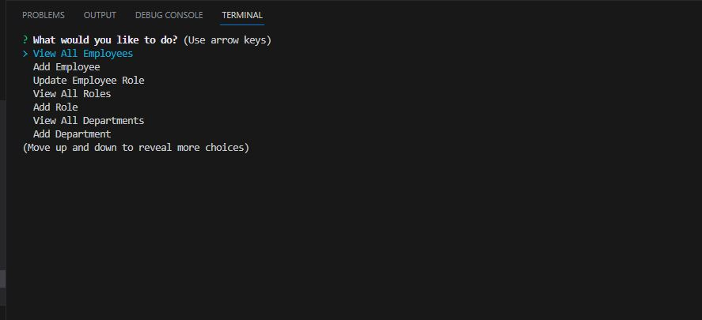
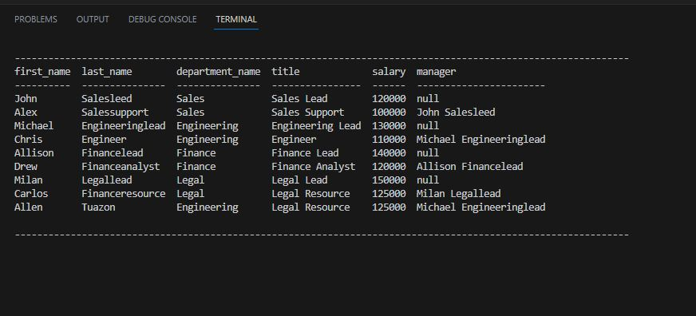

# employee-tracker

## Description

This is a program that will help a user to manage their employee, department and roles.

## Table of Contents
- [Installation](#installation)
- [Usage](#usage)
- [Screenshot](#screenshot)
- [Video recording](#video-recording)
- [Credits](#credits)
- [License](#license)
- [Badges](#badges)
- [Features](#features)
- [Contributing](#contributing)
- [Tests](#tests)
- [Email address](#email-address)
- [Github username](#github-username)

## Installation
Run the schema.sql file in db folder to initialise the database and the tables.
Run the seeds.sql file in db folder to seed the tables with records.
Run npm install to install the dependencies. Then run "node index.js" to run the application.

## Usage
The program is not deployed and can only be run on the terminal as explained in the previous section.

## Screenshot

Below is a screenshot of the application when ran using command line.

## Video recording

Video recording explaining the application can be viewed here: https://drive.google.com/file/d/1yMuRrtSabdldGBTFMHQc2U3X6oTDvnMD/view

## Credits
none

## License
n/a

## Badges

## Features
The following are the functions of the program:
- View All Employees
- Add Employee
- Update Employee Role
- View All Roles
- Add Role
- View All Departments
- Add Department
- Quit (exit application)

## Contributing
n/a

## Tests
N/A

## Email address
allen.tuazon@gmail.com

## Github username
allentpogi